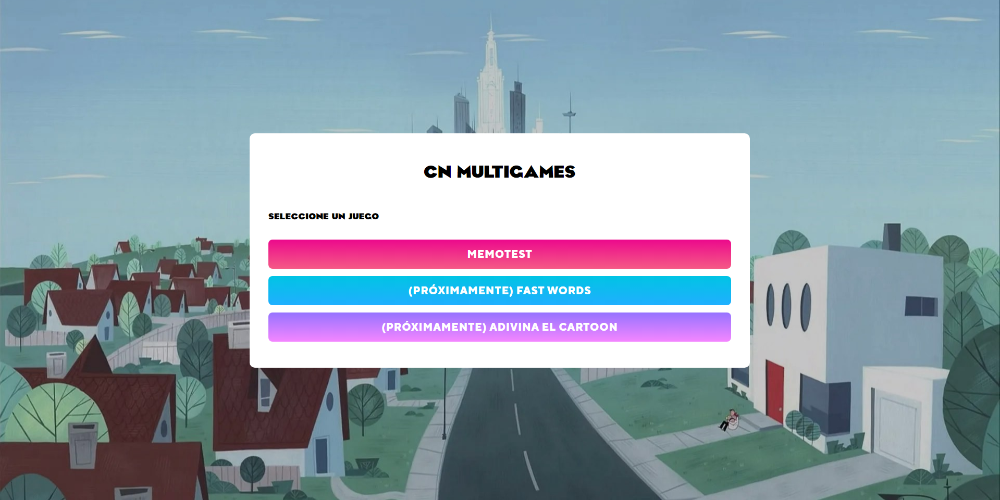
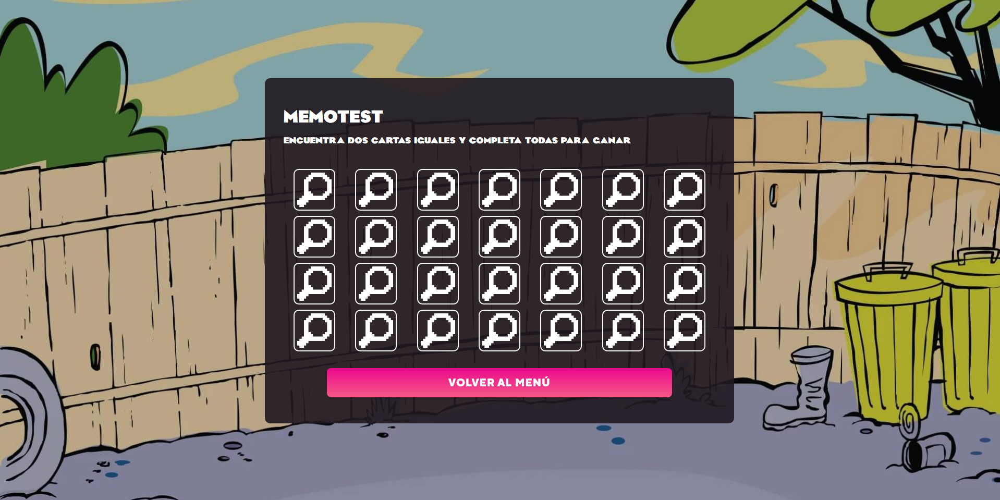
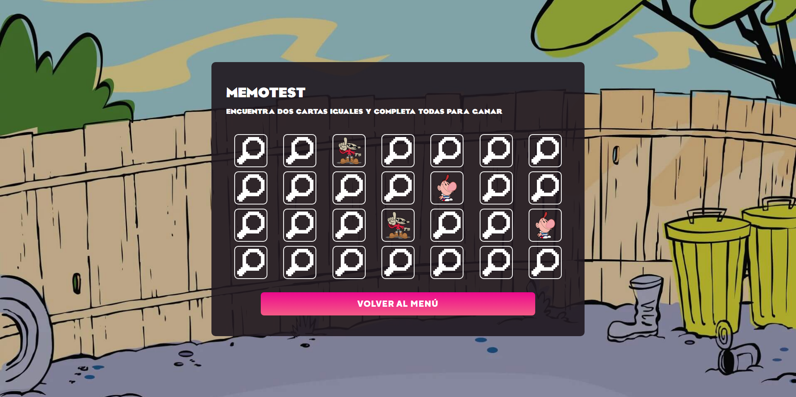
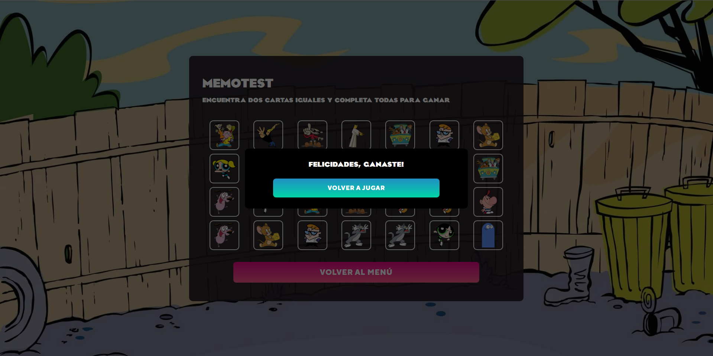

## Hello there! I'm Lautaro Casella 👋

- 🔭 I’m currently looking for a job.
- 🌱 I'm currently strengthening my knowledge in Angular and Typescript.
- 📫 How to reach me: lautaromcasella@gmail.com or [LinkedIn](https://www.linkedin.com/in/lautaro-casella-b990a6216/)

## Languages and Tools

  

  <a href="https://www.w3schools.com/css/">
    
  <a/>
    
  <a href="https://www.w3schools.com/js/default.asp">
    
  <a/>
  
  <a href="https://www.typescriptlang.org/">
    
  <a/>
   
  <a href="https://angular.io/">
    
  <a/>
    
  <a href="https://es.reactjs.org/">
    
  <a/>
    
  <a href="https://www.w3schools.com/sql/sql_intro.asp#:~:text=What%20is%20SQL%3F,for%20Standardization%20(ISO)%20in%201987">
    
  <a/>
    
  <a href="https://www.postman.com/">
    
  <a/>
   
  <a href="https://getbootstrap.com/">
    
  <a/>
    
  <a href="https://git-scm.com/">
    
  <a/>
    
  <a href="https://www.figma.com/">
    
  <a/>

    
## Projects
    
[Cartoon Network Multigames](https://cn-multigames.vercel.app/)

  
  

  
  

    
## Github Languages Stats

<!--
**lmcasella/lmcasella** is a ✨ _special_ ✨ repository because its `README.md` (this file) appears on your GitHub profile.

Here are some ideas to get you started:

- 👯 I’m looking to collaborate on ...
- 🤔 I’m looking for help with ...
- 💬 Ask me about ...
- 😄 Pronouns: ...
- ⚡ Fun fact: ...
-->
