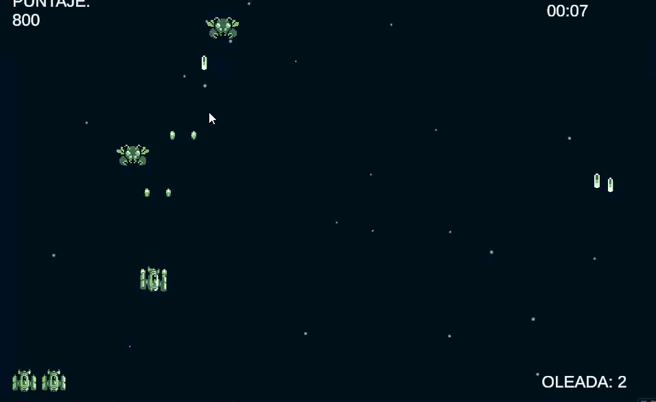

# Hello there! 👋 I'm Lautaro Casella

### Software Developer & Game Development student

## 👨‍💻 About Me

- 🚀 I'm a **Software Developer** and a University Technician in Computer Science.
- 🎓 I'm currently studying for a University Degree in **Video Game Programming**.
- 📫 How to reach me: lautaromcasella@gmail.com or [LinkedIn](https://www.linkedin.com/in/lautaro-casella-b990a6216/)

---

## 🛠️ Tech Stack & Tools

**Game Development & Languages:** 

**Frontend & Web:** 

**Backend, DB & Tools:** 

---

## 🎮 Game Development Projects

Here you can see my projects focused on mechanics, AI and optimization.

|                                                       🗡️ Hacia las Profundidades                                                       |                                                            🚀 Star Attack                                                             |                                                         👾 Cyber Survivors                                                          |
| :------------------------------------------------------------------------------------------------------------------------------------: | :-----------------------------------------------------------------------------------------------------------------------------------: | :---------------------------------------------------------------------------------------------------------------------------------: |
|                                                                                      |                                                                                 |                                                                           |
|      A 2D top-down Roguelike Dungeon Crawler featuring dynamic room clearing, ability progression, and Event-Based Architecture.       | An arcade space shoot 'em up with escalating wave difficulty. Weapon systems built using the Strategy Pattern via Scriptable Objects. | A bullet-heaven arena survival built natively in Pixi.js. Features a custom Spatial Hash algorithm for highly optimized collisions. |
|                                                          **Stack:** Unity, C#                                                          |                                                         **Stack:** Unity, C#                                                          |                                                       **Stack:** JS, Pixi.js                                                        |
| [🔗 Repository](https://github.com/lmcasella/roguelike-game)   [🕹️ Play on itch.io](https://kezgan.itch.io/hacia-las-profundidades) |        [🔗 Repository](https://github.com/lmcasella/star-attack)   [🕹️ Play on itch.io](https://kezgan.itch.io/star-attack)        |   [🔗 Repository](https://github.com/lmcasella/cyber-survivors)   [🕹️ Play on itch.io](https://kezgan.itch.io/cyber-survivors)   |

---

## 💻 Software & Web Projects

### 🏛️ Portal de Datos (Procesamiento de Pagos Municipales)
A full-stack system designed to process, store, and display municipal tax payments. It features an automated background worker for parsing files and a secure REST API for the client interface.
- [Repository](https://github.com/lmcasella/portal-datos)

**Key Features & Architecture:**
- **Clean Architecture:** Strictly decoupled layers (Domain, Application, Infrastructure, Web API) for maintainability.
- **Background Worker Service:** An automated .NET worker that detects and processes incoming payment files (TXT and Excel) using the **Factory Pattern**.
- **High Performance:** Implemented **Dapper** (Micro-ORM) and the **Repository Pattern** for lightning-fast SQL Server database operations.
- **Security & UI:** JWT-based authentication and a responsive **React.js** frontend managing global state with Zustand.

**Stack:** `.NET Core` `C#` `Dapper` `SQL Server` `React.js` `JWT`

 

### 📺 CN Multigames

A responsive web platform featuring classic-style mini-games.

- [Live Demo](https://cn-multigames.vercel.app/) | [Repository](https://github.com/lmcasella/cn-multigames)

<table>
  <tr>
    <td></td>
    <td></td>
  </tr>
  <tr>
    <td></td>
    <td></td>
  </tr>
</table>

### 🌎 Countries App

A web application to search and explore detailed information about countries, utilizing external REST APIs.

- [Live Demo](https://info-countries-app.vercel.app/) | [Repository](https://github.com/lmcasella/countries)

<table>
  <tr>
    <td></td>
    <td></td>
  </tr>
</table>
