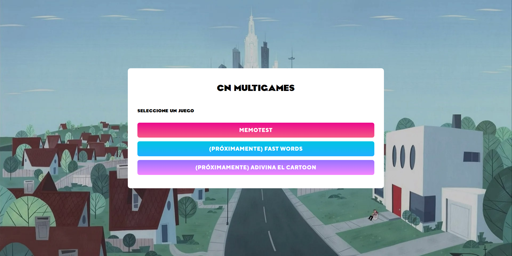
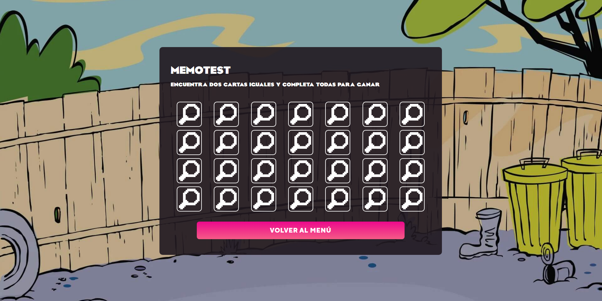
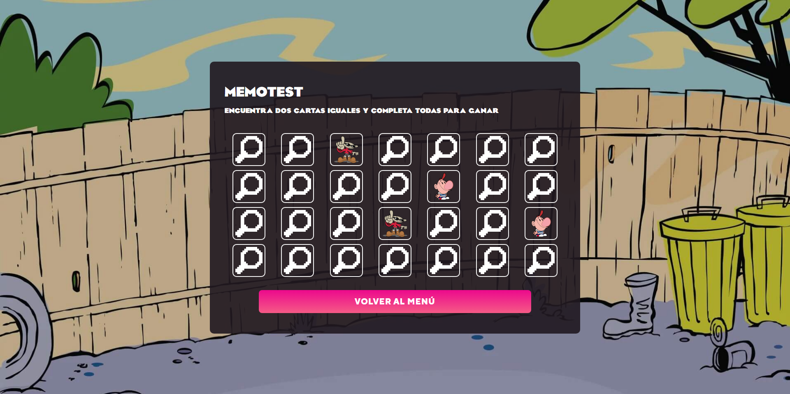
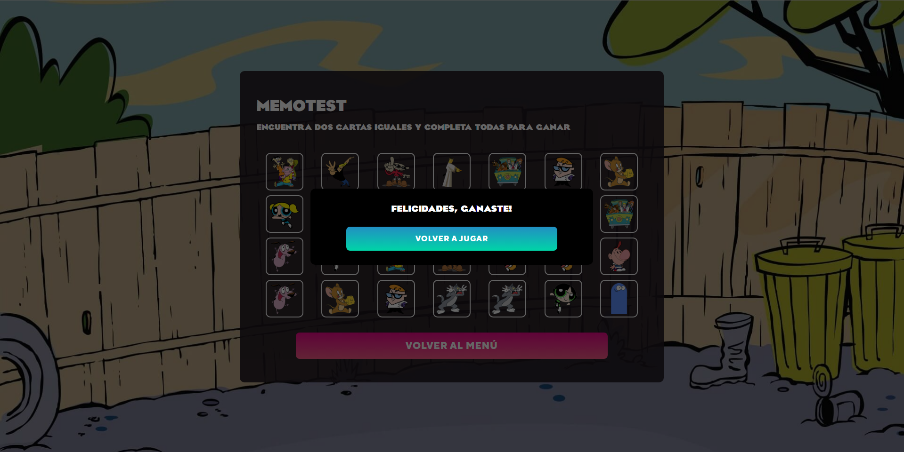
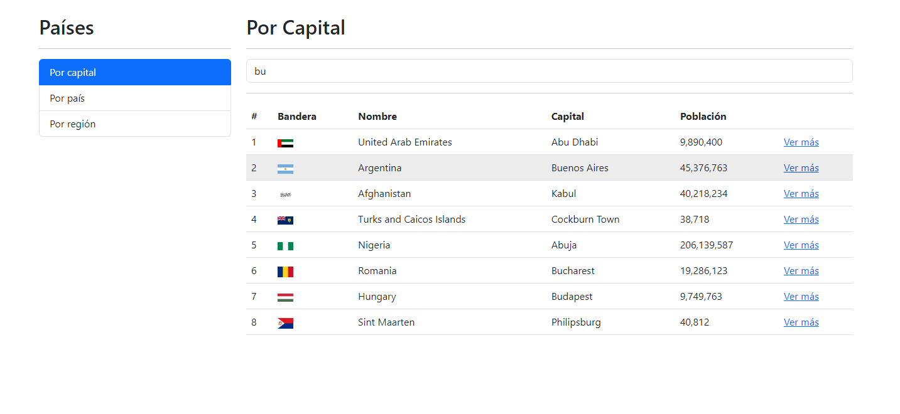
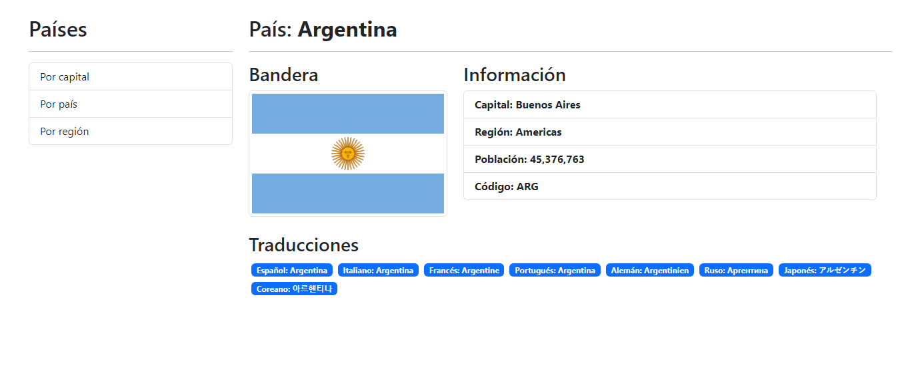

# Hello there! 👋 I'm Lautaro Casella

### Software Developer & Game Development student

## 👨‍💻 About Me
- 🚀 I'm a **Software Developer** and a University Technician in Computer Science.
- 🎓 I'm currently studying for a University Degree in **Video Game Programming**.
- 📫 How to reach me: lautaromcasella@gmail.com or [LinkedIn](https://www.linkedin.com/in/lautaro-casella-b990a6216/)

---

## 🛠️ Tech Stack & Tools

**Game Development & Languages:** 

**Frontend & Web:** 

**Backend, DB & Tools:** 

---

## 🎮 Game Development Projects

Here you can see my projects focused on mechanics, AI and optimization.

| 🗡️ Hacia las Profundidades | 👾 Cyber Survivors | 🚀 Star Attack |
| :---: | :---: | :---: |
| A 2D top-down Roguelike Dungeon Crawler featuring dynamic room clearing, ability progression, and Event-Based Architecture. | A bullet-heaven arena survival built natively in Pixi.js. Features a custom Spatial Hash algorithm for highly optimized collisions. | An arcade space shoot 'em up with escalating wave difficulty. Weapon systems built using the Strategy Pattern via Scriptable Objects. |
| **Stack:** Unity, C# | **Stack:** JS, Pixi.js | **Stack:** Unity, C# |
| [🔗 Repository](https://github.com/lmcasella/roguelike-game)   [🕹️ Play on itch.io](#) | [🔗 Repository](https://github.com/lmcasella/cyber-survivors)   [🕹️ Play on itch.io](#) | [🔗 Repository](https://github.com/lmcasella/star-attack)   [🕹️ Play on itch.io](#) |

---

## 💻 Software & Web Projects

### 📺 Cartoon Network Multigames
A responsive web platform featuring classic-style mini-games.
- [Live Demo](https://cn-multigames.vercel.app/) | [Repository](https://github.com/lmcasella/cn-multigames)

<table>
  <tr>
    <td></td>
    <td></td>
  </tr>
  <tr>
    <td></td>
    <td></td>
  </tr>
</table>

### 🌎 Countries App
A web application to search and explore detailed information about countries, utilizing external REST APIs.
- [Live Demo](https://info-countries-app.vercel.app/) | [Repository](https://github.com/lmcasella/countries)

<table>
  <tr>
    <td></td>
    <td></td>
  </tr>
</table>

---

## 📊 GitHub Stats

  

